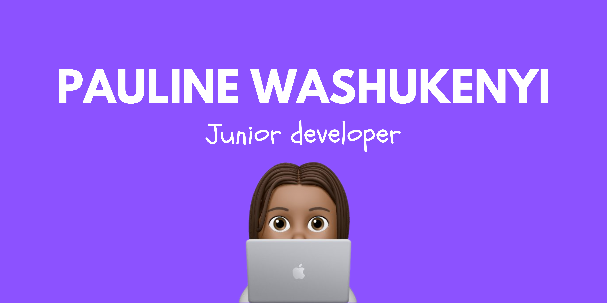
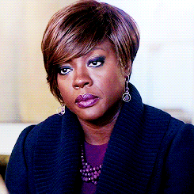

# Hey, I'm Pauline
Former Communication Officer with a knack for creative problem-solving :bulb:. Driven by a passion for Web Development :computer:, I transitioned into tech by self-learning Frontend Development and UX/UI Design through personal projects. To deepen my knowledge and enhance my teamwork skills, I joined a 7-month intensive bootcamp at BeCode. Now, I'm ready to bring my communication expertise, technical skills, and collaborative spirit to new projects and teams.
 
 I would like to contribute to open-source projects and create technology to make them more approachable, elevate people, and building communities. 

# The three things you like the most in this universe.
- My closed ones :heartpulse:
- Food :plate_with_cutlery:
- My bed :sleeping_bed:

*I know it's it's rather cliché, but it's true* :sweat_smile:

# The Objectives you want to achieve as a developer
- Contribute to open-source projects
- Learn a new developement language
- Improve my soft skills

# My fears you might have.
- **Taphophobia** -*Fear of being burried alive*
- **Kenophobia** - *Fear of voids*
- **Mybecodphobia** - *Fear of being late and miss my checkpoint on My Becode*

# The things you look forward to.
- See how I'm going to evolve :rocket:
- Develop increasingly complex web/mobile app :woman_technologist: 
- Find an job :handshake:
  
# The three things I value the most to work as a team
- Respect :handshake:
- Good communication :speech_balloon:
- Creativity :art:

# My favorite GIF

